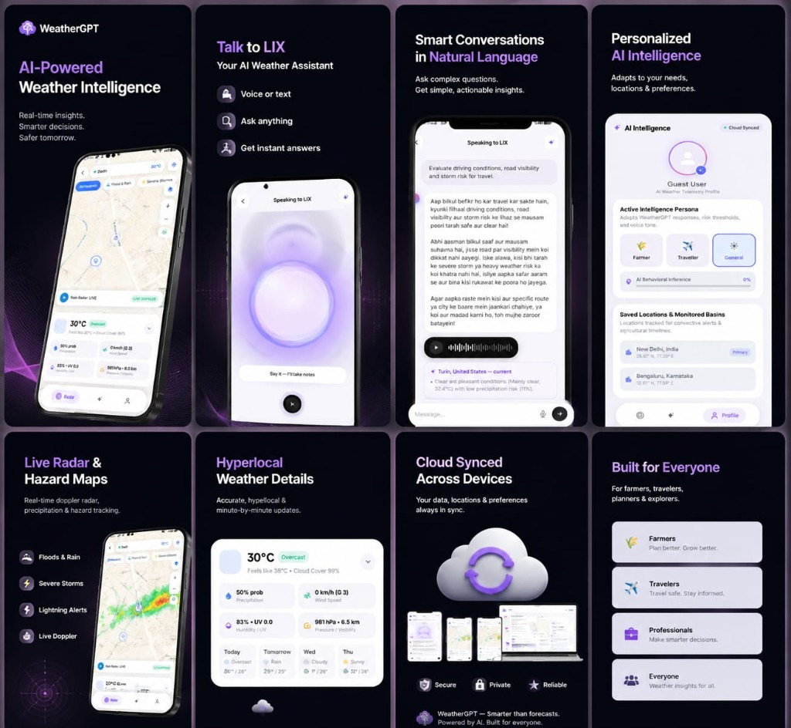
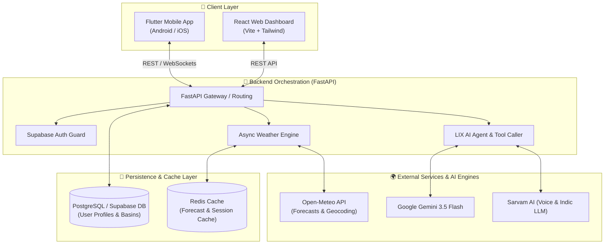

<div align="center">

# 🌤️ WeatherGPT

### **Mobile-First Conversational AI Weather Assistant & Hyperlocal Intelligence Platform**

[](LICENSE)
[](https://python.org)
[](https://fastapi.tiangolo.com)
[](https://flutter.dev)
[](https://reactjs.org)
[](https://docker.com)
[](#-app-release)

<br/>



*Real-time AI insights, voice interaction with LIX, live Doppler radar tracking, and persona-driven weather intelligence.*

</div>

---

## 📌 Table of Contents

- [Overview](#-overview)
- [Key Features](#-key-features)
- [System Architecture](#-system-architecture)
- [Project Structure](#-project-structure)
- [Quick Start Guide](#-quick-start-guide)
  - [Prerequisites](#prerequisites)
  - [1. Running via Docker Compose](#1-running-via-docker-compose)
  - [2. Local Backend Setup (FastAPI)](#2-local-backend-setup-fastapi)
  - [3. Mobile Application Setup (Flutter)](#3-mobile-application-setup-flutter)
  - [4. Web Dashboard Setup (React + Vite)](#4-web-dashboard-setup-react--vite)
- [Environment Configuration](#-environment-configuration)
- [App Release & APK Download](#-app-release--apk-download)
- [API Documentation](#-api-documentation)
- [Contributing](#-contributing)
- [License](#-license)

---

## 🌟 Overview

**WeatherGPT** is a production-ready, open-source AI weather intelligence ecosystem built to bridge raw meteorological data with actionable human decisions. Unlike standard weather forecast applications that only display static numbers and weather icons, WeatherGPT features **LIX**—an interactive AI assistant that understands multi-lingual natural language voice and text queries, contextualizes weather risks, and delivers specialized domain advisories.

Whether you are a **Farmer** monitoring micro-climate spraying windows, a **Traveler** planning road and flight conditions, an **Outdoor Worker** evaluating thermal stress & storm hazards, or an **Urban Commuter** navigating flash floods, WeatherGPT automatically tailors alerts and insights to your profile.

---

## 🔥 Key Features

### 🎙️ 1. Talk to LIX (AI Weather Assistant)
- **Voice & Text Capabilities**: Instant voice recognition and text processing with sub-second response times.
- **Multi-Lingual & Hinglish Understanding**: Seamless handling of English, Hindi, Hinglish, and regional phrasing (e.g. *"Kya kal Delhi me baarish hogi?"*).
- **Tool-Calling Reasoning Pipeline**: Autonomous multi-step tool execution (Geocoding → Current Weather → Multi-Model NWP Comparison → Risk Matrix → Advisory Synthesis).

### 🗺️ 2. Live Radar & Hazard Maps
- **Doppler Radar Layers**: Real-time precipitation tile overlays and reflectivity mapping.
- **Convective Hazard Alerts**: Live detection of severe thunderstorms, lightning bursts, and flash flood risks.
- **Interactive Basins**: Saved geographic basins monitored continuously for convective weather changes.

### 🧠 3. Persona-Driven AI Intelligence
- **Behavioral Inference**: Automatically detects user persona based on conversation history and location preferences.
- **Tailored Action Cards**:
  - 🌾 **Farmers**: Pest infection risk, irrigation windows, wind-drift spraying safety.
  - ✈️ **Travelers**: Driving visibility, road hydroplaning indices, flight turbulence risk.
  - 🏙️ **Urban Commuters**: Drainage overflow risk, heatwave alerts, localized UV indexes.

### ⚡ 4. High-Performance Concurrency Engine
- **Async Multi-Model Weather Retrieval**: Simultaneous asynchronous fetches from Open-Meteo, ECMWF, GFS, and ICON datasets.
- **Redis Multi-Layer Caching**: Caches geo-coordinated forecasts with TTL strategy to achieve <100ms API response latency.
- **Official Warning Integration**: CAP feed integration ready for government severe weather alert broadcasting.

---

## 🏗️ System Architecture



---

## 📂 Project Structure

```text
WeatherGPT/
│
├── README.md                           # Master Project Documentation
├── docker-compose.yml                  # Full-stack container orchestration
├── render.yaml                         # Production cloud deployment manifest
├── .env.example                        # Root environment variable template
├── WeatherGPT_ToolCalling_Spec.md      # OpenAPI & Tool calling protocol spec
│
├── app-release/                        # 📦 Production Mobile Build Package
│   ├── README.md                       # Release installation guide & checksums
│   └── WeatherGPT-v1.0.0.apk           # Android Universal Release APK (~56.7 MB)
│
├── docs/                               # 📚 Specifications & Design Documents
│   ├── PRD.md                          # Product Requirements Document
│   ├── TDD.md                          # Technical Design Document
│   ├── DataModels.md                   # Database Schemas & Data Structures
│   ├── engineering.md                  # Engineering Architecture Standards
│   ├── userflow.md                     # UX Journey Maps & Screen Diagrams
│   └── assets/
│       └── weathergpt_preview.jpg      # 8-Screen Application Preview Banner
│
├── backend/                            # ⚡ FastAPI Async Python Core
│   ├── app/
│   │   ├── main.py                     # ASGI Application Entrypoint
│   │   ├── api/v1/                     # API Routers (Weather, Chat, Voice, Health)
│   │   ├── core/                       # App Configuration & Settings
│   │   ├── services/                   # LLM, Weather, Radar & Alert Services
│   │   ├── database/                   # DB Connection Pools & Repositories
│   │   └── models/                     # Pydantic Schemas & ORM Entities
│   ├── tests/                          # Async Concurrency & Unit Test Suites
│   ├── check_db.py                     # Database Connectivity Diagnostics
│   ├── requirements.txt                # Python Dependencies
│   └── Dockerfile                      # Backend Container Definition
│
├── frontend/                           # 📱 Mobile App (Flutter)
│   ├── lib/
│   │   ├── main.dart                   # Flutter App Entrypoint
│   │   ├── core/                       # Themes, Typography & API Constants
│   │   ├── models/                     # Data Models & Adapters
│   │   ├── services/                   # HTTP Client, Supabase Auth & Location
│   │   ├── providers/                  # State Management (Provider/Riverpod)
│   │   ├── screens/                    # Home, Chat, Weather Detail, Alerts, Profile
│   │   └── widgets/                    # Dynamic Weather Orb, Radar & Glass Cards
│   ├── pubspec.yaml                    # Flutter Package Dependencies
│   └── android/                        # Native Android Build Configuration
│
└── web_app/                            # 🌐 Web Dashboard (React + Vite)
    ├── src/
    │   ├── App.jsx                     # Dashboard Application Component
    │   ├── components/                 # Weather Cards, Chat Input, Risk Badges
    │   └── index.css                   # Glassmorphism Design System
    ├── package.json                    # Node.js Dependencies
    └── vite.config.js                  # Vite Build Configuration
```

---

## ⚡ Quick Start Guide

### Prerequisites
Before running WeatherGPT, ensure you have the following installed on your machine:
- **Docker & Docker Compose** (Recommended) *OR*
- **Python 3.11+**
- **Flutter SDK 3.x+** (For mobile development)
- **Node.js 18+ & npm** (For web dashboard)

---

### 1. Running via Docker Compose

The fastest way to spin up the entire stack (FastAPI Backend, PostgreSQL with pgvector, and Redis Cache) is with Docker Compose:

```bash
# 1. Clone the repository
git clone https://github.com/your-username/WeatherGPT.git
cd WeatherGPT

# 2. Copy the environment file template
cp .env.example .env

# 3. Launch all services
docker-compose up --build
```
Once started:
- 🚀 **Backend API**: `http://localhost:8000`
- 📑 **Swagger API Docs**: `http://localhost:8000/docs`
- 🐘 **PostgreSQL**: `localhost:5432`
- 🔴 **Redis**: `localhost:6379`

---

### 2. Local Backend Setup (FastAPI)

```bash
cd backend

# Create virtual environment
python -m venv venv

# Activate virtual environment
# Windows:
.\venv\Scripts\activate
# Linux/macOS:
source venv/bin/activate

# Install dependencies
pip install -r requirements.txt

# Set up environment variables
cp .env.example .env

# Start FastAPI development server
uvicorn app.main:app --reload --host 0.0.0.0 --port 8000
```

---

### 3. Mobile Application Setup (Flutter)

```bash
cd frontend

# Install Flutter dependencies
flutter pub get

# Run on Android Emulator, iOS Simulator, or connected Device
flutter run
```

---


---

## 🔧 Environment Configuration

| Variable Key | Required | Default Value | Description |
|---|---|---|---|
| `PROJECT_NAME` | No | `"WeatherGPT Backend"` | Application Name |
| `DATABASE_URL` | Yes | `.` | Async PostgreSQL connection URI |
| `REDIS_URL` | Yes | `redis://localhost:6379/0` | Redis caching connection string |
| `DEFAULT_LLM_PROVIDER` | No | `"gemini"` | Active LLM engine (`gemini` or `sarvam`) |
| `GEMINI_API_KEY` | Optional | `""` | Google Gemini AI API key |
| `SARVAM_API_KEY` | Optional | `""` | Sarvam AI Indic language & TTS API key |
| `OPEN_METEO_BASE_URL` | No | `https://api.open-meteo.com/v1` | Open-Meteo Weather API host |
| `GEOCODING_BASE_URL` | No | `https://geocoding-api.open-meteo.com/v1` | Open-Meteo Geocoding host |
| `SUPABASE_URL` | Optional | `https://...` | Supabase Authentication project URL |
| `SUPABASE_KEY` | Optional | `""` | Supabase Anon Public JWT Key |

---

## 📱 App Release & APK Download

An Android production APK build (`v1.0.0`) is available directly inside the [`app-release/`](file:///d:/WeatherGPT/app-release) directory.

### Quick Install:
1. Navigate to [`app-release/WeatherGPT-v1.0.0.apk`](file:///d:/WeatherGPT/app-release/WeatherGPT-v1.0.0.apk).
2. Download the package to your Android device (Android 7.0+).
3. Open the file and follow the installation prompt.

Read [`app-release/README.md`](file:///d:/WeatherGPT/app-release/README.md) for full release release notes, hardware requirements, and **SHA-256 integrity checksums**.

---

## 📑 API Documentation

When the FastAPI server is running, interactive API documentation and spec endpoints are accessible at:

- **Swagger UI**: [`http://localhost:8000/docs`](http://localhost:8000/docs)
- **ReDoc Interface**: [`http://localhost:8000/redoc`](http://localhost:8000/redoc)
- **Tool-Calling Protocol**: [`WeatherGPT_ToolCalling_Spec.md`](file:///d:/WeatherGPT/WeatherGPT_ToolCalling_Spec.md)

---

## 🤝 Contributing

Contributions are warmly welcomed! To contribute:

1. **Fork the Repository**
2. **Create a Feature Branch** (`git checkout -b feature/amazing-feature`)
3. **Commit your changes** (`git commit -m 'Add amazing feature'`)
4. **Push to the Branch** (`git push origin feature/amazing-feature`)
5. **Open a Pull Request**

---

## 📄 License

Distributed under the **MIT License**. See [`LICENSE`](LICENSE) for more details.

---

<div align="center">
  <sub>Built with ❤️ by AI & Weather Engineers. Powered by FastAPI, Flutter, Open-Meteo, & Gemini.</sub>
</div>
